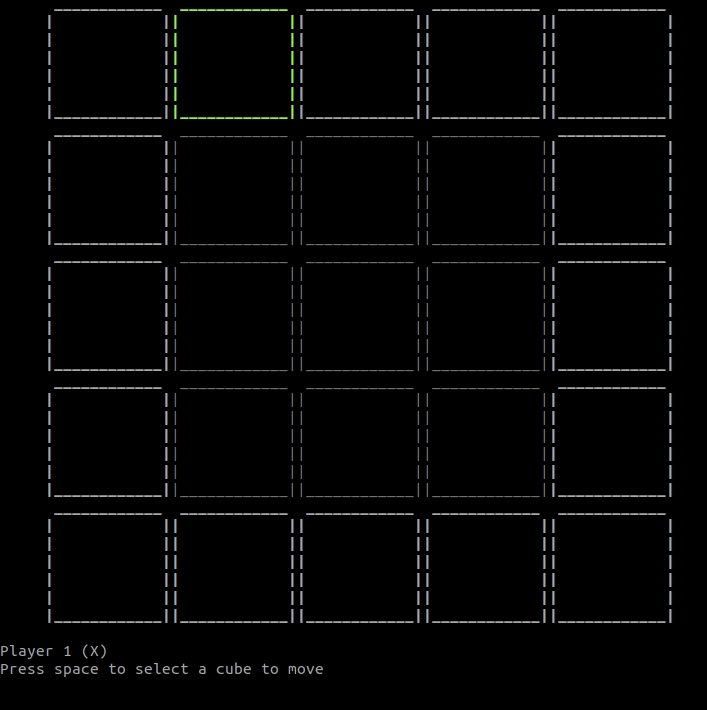

# quixo-python
Play the Quixo game in Python

## Install

Install docker

```
make install
```

## Run

Run the game

```
make run
```

## Test

Runs all the tests of the project

```
make test
```

## Lint

Runs code linter on the project

```
make lint
```

## Example


